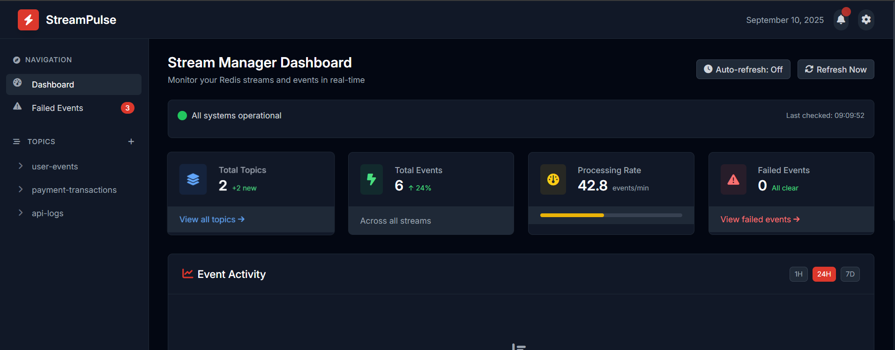

# 

StreamPulse is a Laravel package for event streaming with support for multiple drivers. It provides a simple, unified API for publishing and consuming events across different streaming platforms.

## Features

-   Simple, Laravel-style API for event streaming
-   Redis Streams driver implementation
-   Consumer group support for distributed event processing
-   Dead letter queue for failed message handling
-   UI Dashboard for monitoring streams and events
-   Extensible architecture to support additional drivers
-   Strict mode for controlled topic creation

## Installation

You can install the package via composer:

```bash
composer require saravanasai/stream-pulse
```

You can publish the config file with:

```bash
php artisan vendor:publish --tag="stream-pulse-config"
```

You can also publish the views to customize the UI dashboard:

```bash
php artisan vendor:publish --tag="stream-pulse-views"
```

For a complete step-by-step setup, check the [Quick Start Guide](docs/quick-start.md).

This is the contents of the published config file:

```php
return [
    /*
    |--------------------------------------------------------------------------
    | Default Driver
    |--------------------------------------------------------------------------
    |
    | StreamPulse supports multiple backends. Choose which driver to use
    | globally. Available: "redis", "nats"
    |
    */
    'driver' => env('STREAMPULSE_DRIVER', 'redis'),

    /*
    |--------------------------------------------------------------------------
    | Strict Mode
    |--------------------------------------------------------------------------
    |
    | When strict mode is enabled, only topics explicitly defined in the
    | configuration can be used. This prevents accidental topic creation.
    |
    */
    'strict_mode' => env('STREAMPULSE_STRICT_MODE', true),

    /*
    |--------------------------------------------------------------------------
    | Global Defaults
    |--------------------------------------------------------------------------
    |
    | These settings apply to all topics unless overridden below.
    |
    */
    'defaults' => [
        'max_retries' => 3,
        'dlq' => 'dead_letter',
        'retention' => 1000, // Redis only: default max length
    ],

    /*
    |--------------------------------------------------------------------------
    | Topics
    |--------------------------------------------------------------------------
    |
    | Define per-topic configuration. Each topic can override retry count,
    | DLQ destination, and retention policy.
    |
    */
    'topics' => [
        'orders' => [
            'max_retries' => 5,
            'dlq' => 'orders_dlq',
            'retention' => 5000,
        ],
    ],

    // Additional configuration...
];
```

For detailed configuration information, check the [Configuration Guide](docs/configuration.md).

## Usage

### Publishing Events

StreamPulse provides a simple API for publishing events to any configured topic:

```php
use StreamPulse\StreamPulse\Facades\StreamPulse;

// Publish an event to a topic
StreamPulse::publish('orders', [
    'id' => 1234,
    'customer' => 'John Doe',
    'total' => 99.99,
    'items' => [
        ['product_id' => 101, 'quantity' => 2, 'price' => 49.99]
    ]
]);

// Publish after DB transaction commits
StreamPulse::publishAfterCommit('orders', $orderData);
```

### Consuming Events with Handlers

The recommended way to consume events is to register handlers for your topics:

```php
// In a service provider
StreamPulse::on('orders', function ($payload, $messageId) {
    // Process the order
    OrderProcessor::process($payload);
});

// Then run the consumer command
// php artisan streampulse:consume orders
```

The consumer command will handle all the complexities of polling, acknowledgments, retries, and DLQ management for you.

See the [Consumer API documentation](docs/consumer-api.md) for more details on event handling, retry policies, and scaling.

### Low-level Consumption API

For more control, you can use the low-level consumption API:

```php
use StreamPulse\StreamPulse\Facades\StreamPulse;

// Consume events from a topic with a consumer group
StreamPulse::consume('orders', 'order-processors', function ($payload, $messageId) {
    try {
        // Process the event
        OrderProcessor::process($payload);

        // Acknowledge the message as processed
        StreamPulse::ack('orders', $messageId, 'order-processors');
    } catch (\Exception $e) {
        // Handle error
        // The message will remain in pending state and can be retried
        // After max retries, it will be moved to the DLQ automatically
    }
});
```

Publish events to a specified topic:

```php
use StreamPulse\StreamPulse\Facades\StreamPulse;

// Publish an event
StreamPulse::publish('orders', [
    'id' => 1,
    'status' => 'created',
    'customer_id' => 123,
    'amount' => 99.99,
]);
```

### Stream Retention Management

StreamPulse automatically manages Redis streams to prevent unbounded growth:

```php
// Define global defaults in config/streampulse.php
'defaults' => [
    'retention' => 1000, // Keep 1000 events per stream by default
],

// Override for specific topics
'topics' => [
    'orders' => [
        'retention' => 5000, // Keep more events for important topics
    ],
    'logs' => [
        'retention' => 500, // Keep fewer events for high-volume topics
    ],
],
```

You can also manually trim streams with the provided Artisan command:

```bash
# Trim a specific topic to its configured retention limit
php artisan streampulse:trim orders

# Trim all topics
php artisan streampulse:trim --all

# Override the retention length
php artisan streampulse:trim orders --length=100
```

### Transaction-Aware Event Publishing

Publish events only after a database transaction successfully commits:

```php
use Illuminate\Support\Facades\DB;
use StreamPulse\StreamPulse\Facades\StreamPulse;

DB::transaction(function () {
    // Create an order in the database
    $order = Order::create([
        'customer_id' => 123,
        'amount' => 99.99,
    ]);

    // This event will only be published if the transaction commits successfully
    StreamPulse::publishAfterCommit('orders', [
        'id' => $order->id,
        'status' => 'created',
        'customer_id' => $order->customer_id,
        'amount' => $order->amount,
    ]);

    // If the transaction fails or is rolled back, no event will be published
});
```

### Consuming Events

Consume events from a topic with a consumer group:

```php
use StreamPulse\StreamPulse\Facades\StreamPulse;

// Consume events
StreamPulse::consume('orders', 'billing-service', function ($event, $messageId) {
    // Process the event
    logger('Processing order: ' . $event['id']);

    // After successful processing, acknowledge the message
    StreamPulse::ack('orders', $messageId, 'billing-service');
});
```

#### How Consume Works

The `consume` method takes three parameters:

-   `topic`: The stream topic to consume from (will be prefixed automatically)
-   `group`: Consumer group name for distributed processing
-   `callback`: Function that receives `($event, $messageId)` for each message

When called, it:

1. Creates the consumer group if it doesn't exist
2. Reads messages assigned to this consumer
3. Passes each message to your callback function
4. Requires explicit acknowledgment via `ack()` or `fail()`

### Error Handling

If processing fails, you can mark a message as failed:

```php
use StreamPulse\StreamPulse\Facades\StreamPulse;

StreamPulse::consume('orders', 'billing-service', function ($event, $messageId) {
    try {
        // Process the event
        processOrder($event);

        // Acknowledge successful processing
        StreamPulse::ack('orders', $messageId, 'billing-service');
    } catch (\Exception $e) {
        // Mark as failed (will move to dead letter queue)
        StreamPulse::fail('orders', $messageId, 'billing-service');
        logger()->error('Failed to process order: ' . $e->getMessage());
    }
});
```

## Redis Streams Implementation

StreamPulse uses Redis Streams as the default driver, which provides:

-   Persistent message storage
-   Consumer groups for distributed processing
-   Automatic tracking of processed messages
-   Dead letter queues for failed messages
-   Exactly-once delivery semantics

### Redis Requirements

You need to have Redis installed (version 5.0 or higher) and properly configured in your Laravel application.

## UI Dashboard

StreamPulse includes a web dashboard for monitoring and inspecting your streams and events:



### Features

-   View all available streams/topics
-   Browse events by topic with pagination
-   Examine event details including payload and metadata
-   Track failed events across all topics
-   Real-time monitoring of stream activity
-   Visual analytics of event processing

### Accessing the Dashboard

The dashboard is available at the route `/stream-pulse` and is protected by the `web` and `auth` middleware by default.

Routes include:

-   Dashboard: `/stream-pulse`
-   Topic Events: `/stream-pulse/topics/{topic}`
-   Event Details: `/stream-pulse/topics/{topic}/events/{eventId}`
-   Failed Events: `/stream-pulse/failed`

## Testing

```bash
composer test
```

## Changelog

Please see [CHANGELOG](CHANGELOG.md) for more information on what has changed recently.

## Contributing

Please see [CONTRIBUTING](CONTRIBUTING.md) for details.

## Security Vulnerabilities

Please review [our security policy](../../security/policy) on how to report security vulnerabilities.

## Credits

-   [saravanasai](https://github.com/saravanasai)
-   [All Contributors](../../contributors)

## License

The MIT License (MIT). Please see [License File](LICENSE.md) for more information.

## License

The MIT License (MIT). Please see [License File](LICENSE.md) for more information.
